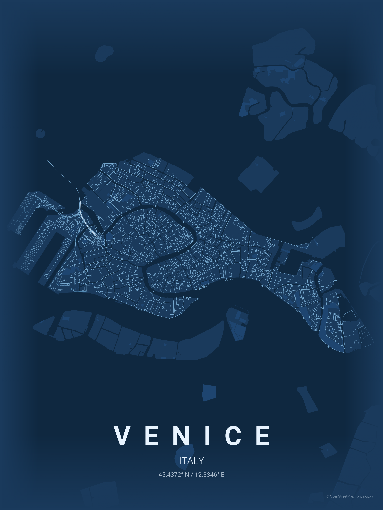

# City Map Poster Generator

Generate beautiful, minimalist map posters for any city in the world.


## Examples

|  Country  |     City      |     Theme      |                                    Poster                                    |
| :-------: | :-----------: | :------------: | :--------------------------------------------------------------------------: |
|    USA    | San Francisco |     sunset     |      |
|   Spain   |   Barcelona   |   warm_beige   |      |
|   Italy   |    Venice     |   blueprint    |          |
|   Japan   |     Tokyo     |  japanese_ink  |        |
|   India   |    Mumbai     | contrast_zones |     |
|  Morocco  |   Marrakech   |   terracotta   |      |
| Singapore |   Singapore   | neon_cyberpunk |  |
| Australia |   Melbourne   |     forest     |          |
|    UAE    |     Dubai     | midnight_blue  |       |

## Installation

```bash
pip install -r requirements.txt
```

## Usage

```bash
python create_map_poster.py --city <city> --country <country> [options]
```

### Options

| Option          | Short | Description                                                                    | Default       |
| --------------- | ----- | ------------------------------------------------------------------------------ | ------------- |
| `--city`        | `-c`  | City name                                                                      | required      |
| `--country`     | `-C`  | Country name                                                                   | required      |
| `--theme`       | `-t`  | Theme name                                                                     | feature_based |
| `--distance`    | `-d`  | Map radius in meters                                                           | 29000         |
| `--list-themes` |       | List all available themes                                                      |               |
| `--all-themes`  |       | Generate posters for all themes                                                |               |
| `--format`      | `-f`  | Output format (png, svg, pdf)                                                  | png           |
| `--resolution`  | `-r`  | Output resolution (e.g., 3840x2160)<br>_DPI will be rounded to whole integers_ |               |
| `--dpi`         |       | DPI for PNG output                                                             | 300           |

### Examples

```bash
# Iconic grid patterns
python create_map_poster.py -c "New York" -C "USA" -t noir -d 12000           # Manhattan grid
python create_map_poster.py -c "Barcelona" -C "Spain" -t warm_beige -d 8000   # Eixample district

# Waterfront & canals
python create_map_poster.py -c "Venice" -C "Italy" -t blueprint -d 4000       # Canal network
python create_map_poster.py -c "Amsterdam" -C "Netherlands" -t ocean -d 6000  # Concentric canals
python create_map_poster.py -c "Dubai" -C "UAE" -t midnight_blue -d 15000     # Palm & coastline

# Radial patterns
python create_map_poster.py -c "Paris" -C "France" -t pastel_dream -d 10000   # Haussmann boulevards
python create_map_poster.py -c "Moscow" -C "Russia" -t noir -d 12000          # Ring roads

# Organic old cities
python create_map_poster.py -c "Tokyo" -C "Japan" -t japanese_ink -d 15000    # Dense organic streets
python create_map_poster.py -c "Marrakech" -C "Morocco" -t terracotta -d 5000 # Medina maze
python create_map_poster.py -c "Rome" -C "Italy" -t warm_beige -d 8000        # Ancient street layout

# Coastal cities
python create_map_poster.py -c "San Francisco" -C "USA" -t sunset -d 10000    # Peninsula grid
python create_map_poster.py -c "Sydney" -C "Australia" -t ocean -d 12000      # Harbor city
python create_map_poster.py -c "Mumbai" -C "India" -t contrast_zones -d 18000 # Coastal peninsula

# River cities
python create_map_poster.py -c "London" -C "UK" -t noir -d 15000              # Thames curves
python create_map_poster.py -c "Budapest" -C "Hungary" -t copper_patina -d 8000  # Danube split

# List available themes
python create_map_poster.py --list-themes

# Generate all themes for a city
python create_map_poster.py --city "Tokyo" --country "Japan" --all-themes

# Custom resolution output
python create_map_poster.py -c "Paris" -C "France" -t noir -r 3840x2160

# Custom DPI output
python create_map_poster.py -c "London" -C "UK" -t blueprint --dpi 600

# SVG output for vector editing
python create_map_poster.py -c "Amsterdam" -C "Netherlands" -t ocean -f svg
```

### Distance Guide

| Distance     | Best for                                           |
| ------------ | -------------------------------------------------- |
| 4000-6000m   | Small/dense cities (Venice, Amsterdam center)      |
| 8000-12000m  | Medium cities, focused downtown (Paris, Barcelona) |
| 15000-20000m | Large metros, full city view (Tokyo, Mumbai)       |

## Themes

17 themes available in `themes/` directory:

| Theme             | Description                                                                 |
| ----------------- | --------------------------------------------------------------------------- |
| `autumn`          | Burnt oranges, deep reds, golden yellows - seasonal warmth                  |
| `blueprint`       | Classic architectural blueprint - technical drawing aesthetic               |
| `contrast_zones`  | Strong contrast showing urban density - darker in center, lighter at edges  |
| `copper_patina`   | Oxidized copper aesthetic - teal-green patina with copper accents           |
| `feature_based`   | Different shades for different road types and features with clear hierarchy |
| `forest`          | Deep greens and sage tones - organic botanical aesthetic                    |
| `gradient_roads`  | Smooth gradient from dark center to light edges with subtle features        |
| `japanese_ink`    | Traditional ink wash inspired - minimalist with subtle red accent           |
| `midnight_blue`   | Deep navy background with gold/copper roads - luxury atlas aesthetic        |
| `monochrome_blue` | Single blue color family with varying saturation - clean and cohesive       |
| `neon_cyberpunk`  | Dark background with electric pink/cyan - bold night city vibes             |
| `noir`            | Pure black background with white/gray roads - modern gallery aesthetic      |
| `ocean`           | Various blues and teals - perfect for coastal cities                        |
| `pastel_dream`    | Soft muted pastels with dusty blues and mauves - dreamy artistic aesthetic  |
| `sunset`          | Warm oranges and pinks on soft peach - dreamy golden hour aesthetic         |
| `terracotta`      | Mediterranean warmth - burnt orange and clay tones on cream                 |
| `warm_beige`      | Earthy warm neutrals with sepia tones - vintage map aesthetic               |

## Output

Posters are saved to `posters/{city}/` directory with format:

```
{city}_{theme}_{YYYYMMDD_HHMMSS}.{format}
```

Default output:

- **Format**: PNG (also supports SVG and PDF)
- **Resolution**: 3600×4800 pixels (3:4 portrait aspect ratio at 300 DPI)
- **Dimensions**: 12" × 16" at 300 DPI

Custom resolution example: `--resolution 2400x3200` (portrait) or `--resolution 3840x2160` (landscape 4K)  
Custom DPI example: `--dpi 600` (high quality print)

## Adding Custom Themes

Create a JSON file in `themes/` directory:

```json
{
    "name": "My Theme",
    "description": "Description of the theme",
    "bg": "#FFFFFF",
    "text": "#000000",
    "gradient_color": "#FFFFFF",
    "water": "#C0C0C0",
    "parks": "#F0F0F0",
    "road_motorway": "#0A0A0A",
    "road_primary": "#1A1A1A",
    "road_secondary": "#2A2A2A",
    "road_tertiary": "#3A3A3A",
    "road_residential": "#4A4A4A",
    "road_default": "#3A3A3A"
}
```

## Project Structure

```
maptoposter/
├── create_map_poster.py          # Main entry point
├── requirements.txt              # Python dependencies
├── pytest.ini                    # Test configuration
├── src/
│   ├── __init__.py              # Package initialization
│   ├── cli.py                   # Command-line interface
│   ├── config.py                # Configuration constants
│   ├── geocoding.py             # City coordinate lookup
│   ├── data_fetcher.py          # OSM data fetching
│   ├── renderer.py              # Map rendering logic
│   ├── poster_generator.py      # Poster generation pipeline
│   ├── theme.py                 # Theme loading and management
│   ├── cache.py                 # Caching system
│   └── utils.py                 # Utility functions
├── tests/                       # Unit tests
├── themes/                      # Theme JSON files
├── fonts/                       # Roboto font files
├── cache/                       # Cached geocoding/OSM data
└── posters/                     # Generated posters (organized by city)
```

## Hacker's Guide

Quick reference for contributors who want to extend or modify the script.

### Architecture Overview

```
┌─────────────────┐     ┌──────────────┐     ┌─────────────────┐
│   CLI Parser    │────▶│  Geocoding   │────▶│  Data Fetching  │
│   (argparse)    │     │  (Nominatim) │     │    (OSMnx)      │
└─────────────────┘     └──────────────┘     └─────────────────┘
                                                     │
                        ┌──────────────┐             ▼
                        │    Output    │◀────┌─────────────────┐
                        │  (matplotlib)│     │   Rendering     │
                        └──────────────┘     │  (matplotlib)   │
                                             └─────────────────┘
```

### Key Functions

| Function                    | File                | Purpose                           | Modify when...               |
| --------------------------- | ------------------- | --------------------------------- | ---------------------------- |
| `get_coordinates()`         | geocoding.py        | City → lat/lon via Nominatim      | Switching geocoding provider |
| `fetch_map_data()`          | data_fetcher.py     | Fetch OSM graph, water, and parks | Adding new data layers       |
| `render_poster()`           | renderer.py         | Main rendering pipeline           | Adding new map features      |
| `get_edge_colors_by_type()` | renderer.py         | Assign colors by highway type     | Changing road color styling  |
| `get_edge_widths_by_type()` | renderer.py         | Assign widths by highway type     | Adjusting line weights       |
| `create_gradient_fade()`    | renderer.py         | Edge fade effect                  | Modifying gradient overlay   |
| `load_theme()`              | theme.py            | Load JSON theme → dict            | Adding theme properties      |
| `generate_single_poster()`  | poster_generator.py | Complete single poster pipeline   | Changing generation workflow |
| `generate_all_themes()`     | poster_generator.py | Batch generate all themes         | Modifying batch processing   |

### Rendering Layers (z-order)

```
z=11  Text labels (city, country, coords)
z=10  Gradient fades (top & bottom)
z=3   Roads (via ox.plot_graph)
z=2   Parks (green polygons)
z=1   Water (blue polygons)
z=0   Background color
```

### OSM Highway Types → Road Hierarchy

```python
# In get_edge_colors_by_type() and get_edge_widths_by_type()
motorway, motorway_link     → Thickest (1.2), darkest
trunk, primary              → Thick (1.0)
secondary                   → Medium (0.8)
tertiary                    → Thin (0.6)
residential, living_street  → Thinnest (0.4), lightest
```

### Adding New Features

**New map layer (e.g., railways):**

```python
# In create_poster(), after parks fetch:
try:
    railways = ox.features_from_point(point, tags={'railway': 'rail'}, dist=dist)
except:
    railways = None

# Then plot before roads:
if railways is not None and not railways.empty:
    railways.plot(ax=ax, color=THEME['railway'], linewidth=0.5, zorder=2.5)
```

**New theme property:**

1. Add to theme JSON: `"railway": "#FF0000"`
2. Use in code: `THEME['railway']`
3. Add fallback in `load_theme()` default dict

### Typography Positioning

All text uses `transform=ax.transAxes` (0-1 normalized coordinates):

```
y=0.14  City name (spaced letters)
y=0.125 Decorative line
y=0.10  Country name
y=0.07  Coordinates
y=0.02  Attribution (bottom-right)
```

### Useful OSMnx Patterns

```python
# Get all buildings
buildings = ox.features_from_point(point, tags={'building': True}, dist=dist)

# Get specific amenities
cafes = ox.features_from_point(point, tags={'amenity': 'cafe'}, dist=dist)

# Different network types
G = ox.graph_from_point(point, dist=dist, network_type='drive')  # roads only
G = ox.graph_from_point(point, dist=dist, network_type='bike')   # bike paths
G = ox.graph_from_point(point, dist=dist, network_type='walk')   # pedestrian
```

### Performance Tips

- Large `dist` values (>20km) = slow downloads + memory heavy
- Cache coordinates locally to avoid Nominatim rate limits
- Use `network_type='drive'` instead of `'all'` for faster renders
- Reduce `dpi` from 300 to 150 for quick previews
